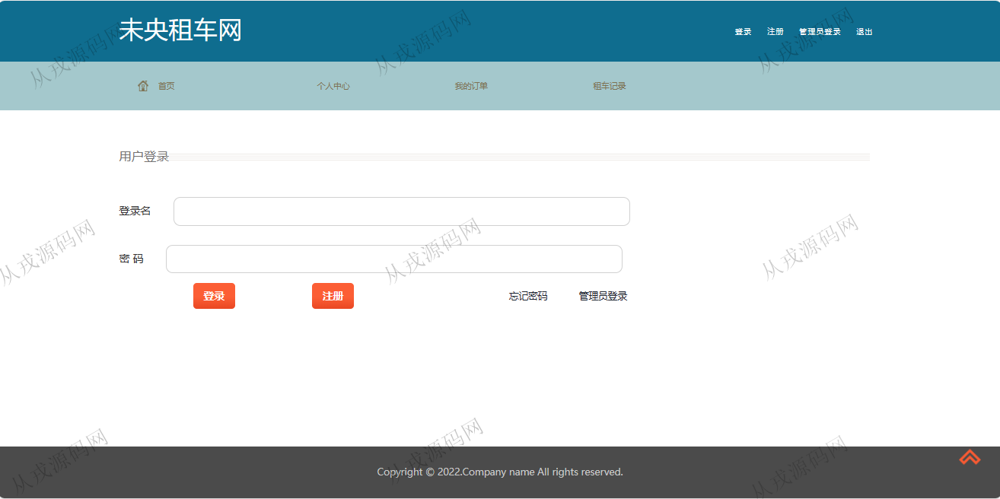
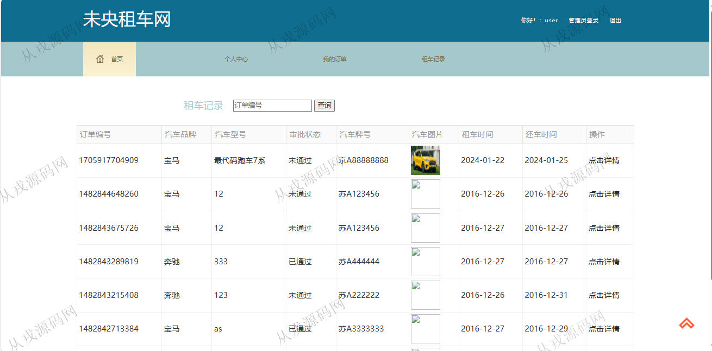
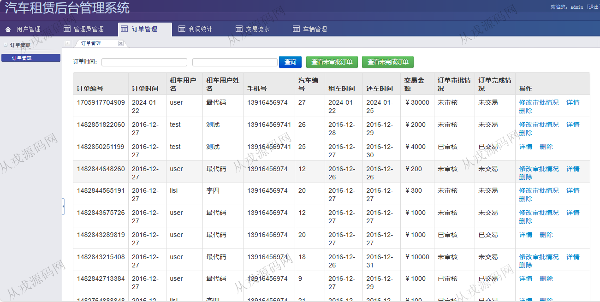
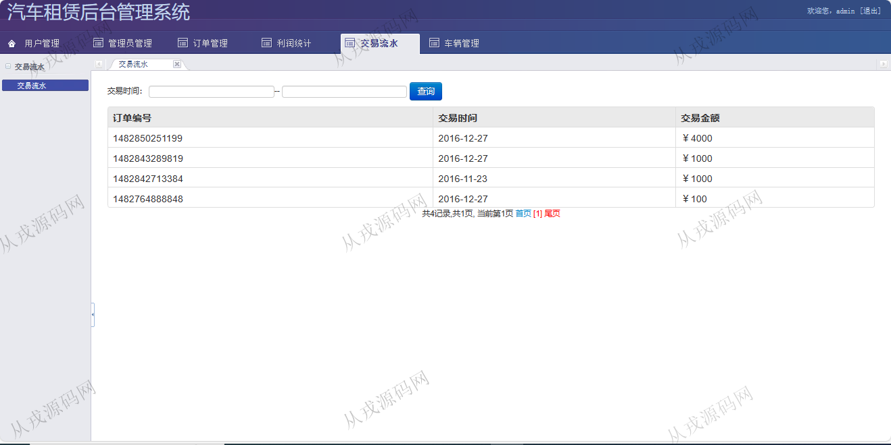

<h1 align="center">207.汽车租聘管理系统</h1>

 获取sql文件 QQ: 386869957 QQ群: 377586148 

 [更多源码项目: 从戎源码网](https://armycodes.com/) 

## 简介

> 本代码来源于网络,仅供学习参考使用!
>
> 提供1.远程部署/2.修改代码/3.设计文档指导/4.框架代码讲解等服务
>
> 用户登录地址：http://localhost:8080/car/login_login.do?role=1
> 
> 用户：user 123456
> 
> 管理员登录地址：http://localhost:8080/car/login_login.do?role=2
>
> 管理员：admin 123456
>

## 项目介绍
基于ssh的汽车租聘管理系统：前端 jsp、jquery、bootstrap，后端 struts、spring、hibernate；角色分为管理员、用户；集成在线租车、我的订单、租车记录等功能于一体的系统。

## 功能介绍

### 用户

- 基本功能：登录，注册，退出，个人信息查看与修改，密码修改
- 租车：租车列表展示，全局搜索，租车详情，在线租车，确认租车
- 我的订单：订单列表查询，按订单编号搜索查询，订单详情，修改订单
- 租车记录：租车后历史记录信息查询，按订单编号搜索查询

### 管理员

- 车辆管理：车辆信息的增删改查，车辆图片信息上传
- 车辆品牌管理：品牌信息的增删改查
- 用户管理：用户信息的增删改查
- 管理员管理：管理员信息的增删改查
- 订单管理：订单信息的增删改查，修改审批情况
- 利润统计：统计信息的列表查询
- 交易流水：交易信息的列表查询，按交易开始和结束时间查询交易记录

## 环境

- <b>IntelliJ IDEA 2021.3</b>

- <b>Mysql 5.7.26</b>

- <b>Tomcat 7.0.73</b>

- <b>JDK 1.8</b>

## 运行截图

